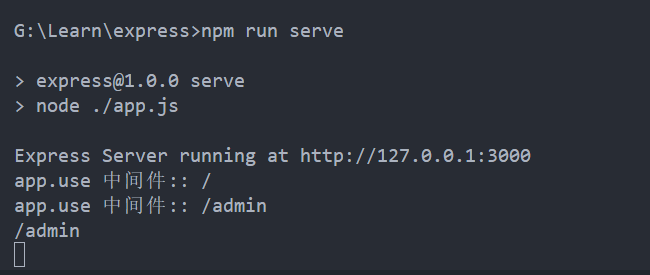
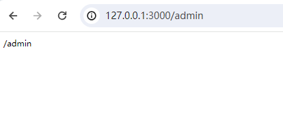

# 初识 Express

## 是什么

[Express 英文网](https://expressjs.com/)

[Express 中文网](https://www.expressjs.com.cn/)

官网概念：Express 是基于 Node.js 平台，快速、开放、极简的 Web 开发框架。

通俗理解: Express 的作用和 Node,js 内置的 http 模块类似，是专门用来创建 Web 服务器的。本质上是一个第三方 npm 包，提供快速创建 Web 服务器的便捷方法。

框架特性：

1. 提供了方便简洁的路由定义方式;
2. 对获取 HTTP 请求参数进行了简化处理;
3. 对模板引擎支持程度高，方便渲染动态 HTML 页面;
4. 提供了中间件机制有效控制 HTTP 请求;
5. 拥有大量第三方中间件对功能的扩展;

## 做什么

使用 Express 可以快速地搭建一个完整功能的网站，方便、快速的创建 Web 网站的服务器或 API 接口的服务器。

Express 框架核心特性：

1. 可以设置中间件来响应 HTTP 请求;
2. 定义了路由表用于执行不同的 HTTP 请求动作;
3. 可以通过向模板传递参数来动态渲染 HTML 页面;

# 如何使用 Express

## 初始化项目

> 本地已安装 NodeJs

### 1. 创建项目文件夹

```shell
mkdir MyExpressApp
cd MyExpressApp
```

### 2. 初始化 npm，创建 package.json 文件，并使用默认配置

```shell
npm init -y
```

### 3. 安装 Express 依赖包

```shell
npm i express -S
```

## 二、创建基本的 web 服务器

### 1. 根目录创建入口文件，app.js

```js
// 导入 express
const express = require("express");

// 创建 web 服务器
const app = express();

// 调用 app.listen(端口号,启动成功后的回调函数),启动服务器
app.listen(3000, () => {
  console.log("Express Server running at http://127.0.0.1:3000");
});
```

### 2. 启动项目

### 创建快捷命令

- 修改 package.json 文件；
- scripts 添加"serve": "node ./app.js"

### 终端执行命令

```shell
npm run serve
```

### 访问http://127.0.0.1:3000


## 三、创建基本路由

```js
// 导入 express
const express = require("express");

// 创建 web 服务器
const app = express();

// 处理路由 send():
// 1. send方法内部会检测响应内容的类型;
// 2. send方法会自动设置http状态码;
// 3. send方法会帮我们自动设置响应的内容类型及编码;
// 4. send方法相当于取代了原生http模块中的res.end()方法, 更为强大;

app.get("/", (req, res) => {
  res.send("Hello Express!");
});

app.get("/admin", (req, res) => {
  res.send({
    name: "Meng",
    time: new Date(),
  });
});

// 调用 app.listen(端口号,启动成功后的回调函数),启动服务器
app.listen(3000, () => {
  console.log("Express Server running at http://127.0.0.1:3000");
});
```


## 四、中间件

中间件功能是可以访问请求对象（req），响应对象（res）以及应用程序请求 - 响应周期中的下一个中间件功能的函数; 下一个中间件函数通常用名为 next 的变量表示。

中间件功能可以执行以下任务：

1. 执行任何代码;
2. 对请求和响应对象进行更改;
3. 结束请求 - 响应循环;
4. 调用堆栈中的下一个中间件功能;

如果当前的中间件功能没有结束请求 - 响应周期，则它必须调用 next()以将控制传递给下一个中间件功能。否则，请求将被挂起。

```js
// 导入 express
const express = require("express");

// 创建 web 服务器
const app = express();

// 中间件1
app.get("/admin", (req, res, next) => {
  console.log("中间件1");
  req.name = "Meng";
  next();
});

// 中间件2
app.get("/admin", (req, res) => {
  console.log("中间件2");
  res.send({
    name: req.name,
  });
});

// 调用 app.listen(端口号,启动成功后的回调函数),启动服务器
app.listen(3000, () => {
  console.log("Express Server running at http://127.0.0.1:3000");
});
```


## 五、app.use()

根据需求，自定义中间件，通常有以下功能：

- 路由保护，网站用户鉴权认证
- 网站维护公告
- 路由访问日志打印
- 异常处理
- 404 页面
- 参数处理，post 参数，body-parser
- ...

```js
// 导入 express
const express = require("express");
// 创建 web 服务器
const app = express();

// app.use():
// 1. 匹配所有的请求方式，可以直接传入请求处理函数，代表接收所有的请求;
// 2. 第一个参数也可以传入路径，代表不论是什么请求，只要有这个请求路径，那么就接收这个请求;

// 不限制请求路径, 所有路径都被其捕获;
// 不限制请求方式, 所有请求方式都能被捕获;
app.use((req, res, next) => {
  console.log("app.use 中间件:: " + req.url);
  next();
});

app.get("/home", (req, res) => {
  console.log(req.url);
  res.send(req.url);
});

app.get("/admin", (req, res, next) => {
  console.log(req.url);
  res.send(req.url);
});

app.listen(3000, () => {
  console.log("Express Server running at http://127.0.0.1:3000");
});
```






## 六、异常处理

在程序执行过程当中，不可避免的会出现一些无法预料的错误，比如文件读取失败，数据库连接失败。我们需要对程序运行中发生的错误异常进行兜底处理。

```js
// 导入 express
const express = require("express");

// 创建 web 服务器
const app = express();

app.get("/", (req, res, next) => {
  try {
    if (Math.random() > 0.4) {
      const result = "success request";
      console.log(result);
      res.send(result);
    } else {
      throw new Error("error request");
    }
  } catch (error) {
    next(error.message);
  }
});

// 异常处理
app.use((err, req, res) => {
  res.status(500).send(err.message);
});

app.listen(3000, () => {
  console.log("Express Server running at http://127.0.0.1:3000");
});
```


## 七、模块化路由

使用该类 express.Router 创建模块化、可安装的路由处理程序。实例 Router 是一个完整的中间件和路由系统；因此，它通常被称为“迷你应用程序”。

以下示例将路由器创建为模块，在其中加载中间件功能，定义一些路由，并将路由器模块安装在主应用程序中的路径上。

在根目录创建一个名为 router 的文件夹并新建 user.js 文件：

```js
const express = require("express");

// 创建模块化路由
const router = express.Router();

// 监听/user下的所有路由，打印访问日志
router.use((req, res, next) => {
  console.log("url: ", req.url);
  console.log("Time: ", Date.now());
  next();
});

// 测试用户信息数据
const userInfo = {
  name: "Meng",
  age: 1,
};

// 获取用户信息
router.get("/getUserInfo", (req, res) => {
  res.send({
    code: 1,
    data: userInfo,
  });
});

// 更新用户信息
router.get("/updateUserInfo", (req, res) => {
  const setUserInfo = {
    name: "Dom",
  };
  res.send({
    code: 1,
    data: { ...userInfo, ...setUserInfo },
  });
});

module.exports = router;
```

./app.js 文件

```js
// 导入 express
const express = require("express");

// 导入 userRouter
const userRouter = require("./router/user.js");

// 创建 web 服务器
const app = express();

// 注册user路由
app.use("/user", userRouter);

app.listen(3000, () => {
  console.log("Express Server running at http://127.0.0.1:3000");
});
```


